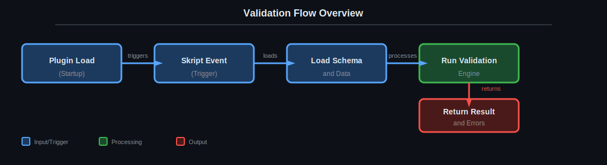

# Explanation

This section contains conceptual documentation that explains **why** the system behaves the way it does. Unlike tutorials (which teach step-by-step) or reference (which documents exact syntax), the Explanation section focuses on architecture, design decisions, and known constraints.

## Available Sections

| Section | Description | Purpose |
|---------|-------------|---------|
| [Runtime architecture](architecture.md) | Execution architecture overview | Understand how the plugin initializes and processes validations |
| [Known design constraints](design-constraints.md) | Known limitations and constraints | Understand technical and behavioral limitations |
| [Documentation audit](documentation-audit.md) | Audit and reconstruction report | Historical context for documentation decisions |

## Validation Flow - Overview

The Schema-Validator validation process follows a structured flow:

### Flow Components

| Step | Description |
|------|-------------|
| **Plugin Load** | Plugin loads configuration, registers schemas, and initializes static context |
| **Skript Event** | A Skript script triggers validation using `validate yaml/json ... using schema ...` |
| **Load Schema & Data** | System loads the JSON schema and data file (YAML or JSON) |
| **Run Validation Engine** | Validators process data according to schema rules |
| **Return Result & Errors** | Validation result and any errors are returned |

## Why This Section Matters

- **Architecture** helps developers understand how to integrate or extend the plugin
- **Constraints** alerts about limitations that may impact specific use cases
- **Audit** documents historical decisions and rationale behind current structure

---

[← Previous](../reference/config-reference.md) | [Next →](architecture.md) | [Home](../../README.md)
